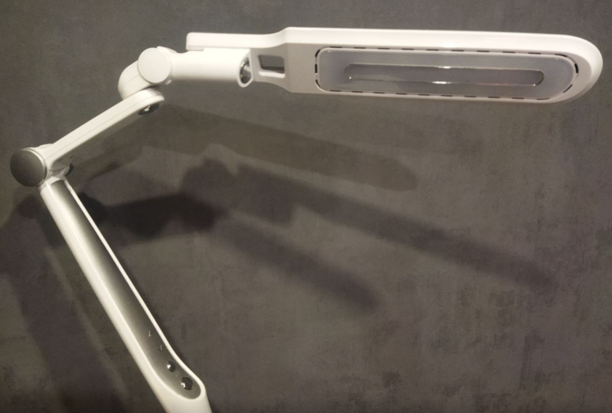
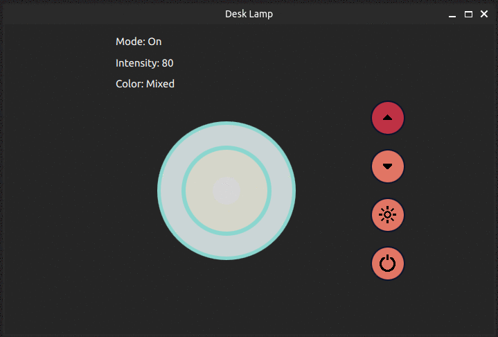

## 💡 Desk Lamp 💡

Мой первый проект на **Qt**

Пытался разобраьтся как работает *Qt* и *QML*  на примере своей настолькой лампы. Завернул всё в простейший *MVC* паттерн. 

Вот и сам подопытный: 

Имеет 4 кнопки: 

- Включение / Выключение
- Смена режима (теплый,холодный, нейтральный)
- Яркость +
- Яркость -

